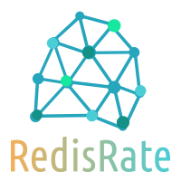
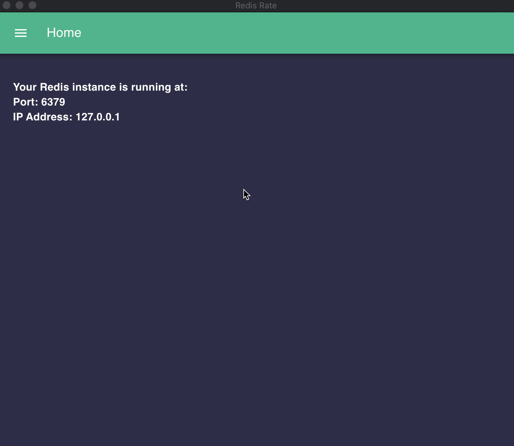

RedisRate is a simple to use and use-case agnostic analytic tool built to aid developers in making informed database management descisions through visualization of key Redis performance metrics.

## Beta Phase

RedisRate is in BETA phase. Pull requests and contributions are welcome. Create an issue or contact a member of the team if you would like to contribute.

## Getting Started 🏁

1. Clone this repository.
2. Run `npm install`
3. To run application,
   `npm run redis-rate`

## ✨ Usage

<!-- electron packager -->
Sign in by entering your username and password. 

If this is your first time using the application, create an account by clicking sign up.

<!-- add a picture of sign up -->

Once logged in, make sure your Redis server is running and connect your Redis database by entering its IP address, port number, and Redis auth password. If you have not configured your Redis Server to require a password, leave the password input field blank as the app can connect without it. Upon successful connection, use the navigation menu to view performance metrics of your Redis instance.

<!-- add picture of port page -->

Memory

<!-- add picture of port page -->

Latency

<!-- add picture of port page -->

Throughput

<!-- add picture of port page -->

## Developers

[Matthew Marchand](https://github.com/m-marchand)

[Navi Dhillon](https://github.com/Super-Programmer-Navi)

[Heidi Bang](https://github.com/heidibang)

[Dawn Chung](https://github.com/dawn-chung27)

## 📝 License

[MIT](https://choosealicense.com/licenses/mit/)
